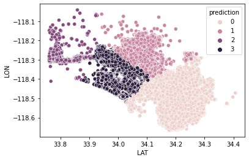

# LA-Crime-Analysis
Perform spatial and time series analysis for a 10-year dataset of reported crimes from LA government. 

Part 1: Big data OLAP.

Part 2: Clustered and visualized the spatial crime data by training and fine-tuning a Spark ML K-means model.

Part 3: Built a SARIMAX model to predict the number of crimes 1 year in advance.
